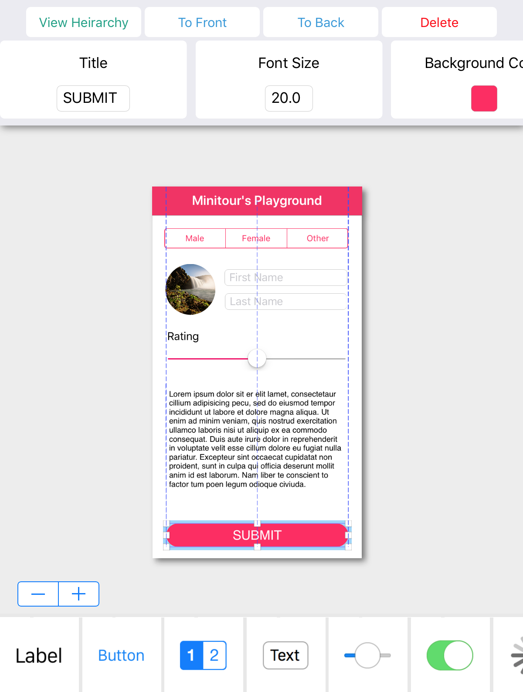
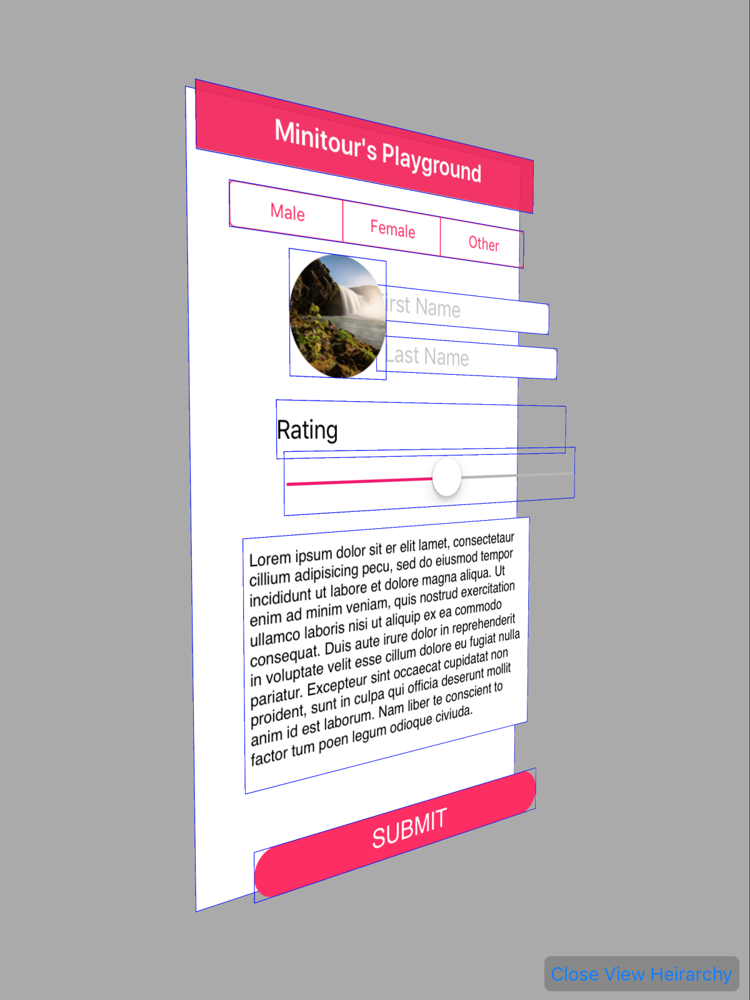

# Micro Interface Builder
### A lightweight Interface Builder

## Idea and Concept
Ever since Playgrounds have been introduced back in WWDC 2014 we've seen many tutorials revolving around Swift and what we can do with it, However we have never really dug into iOS's interface development tools. With that being said, I decided to make my playground all about the Interface Builder tool that has been around in Xcode ever since we can remember.

## The Architecture and Infrastructure
The project is separated into four main parts:

### The Component View

The component view is a tool bar that consists a list of views/components that can be used to to design the interface with on the canvas view. Since all components are a subclass of UIView they share a list of common properties, However, each component has it's own unique set of properties. These properties are called "Inspectables" and they can be viewed and edited using The Property Inspector.

### The Property Inspector

Is a tool bar that can be found on the top-part of the layout. It displays the inspectable fields of the selected element component. It consists of properties such as `String`, `Int`, `Float`, `Precent` (0~100), `Boolean`, `Color`, `Image` and `Auto Resizing Mask`.

### The Canvas View

It is the main view which accepts the drops from the component view and the view on which we design the the layout. Once a drop transaction has been accepted by the canvas view, The canvas automatically converts the component into a `DraggableView` and sets it's `contentView` property using the `ComponentDataSource` class which is in charge of providing all the components and their implementation. The canvas always keeps track of the draggable views in order to manage them, as well as converting it-self into a renderable view recursively in order to be inspected using the 3D Hierarchy Inspector.

### The 3D Hierarchy Inspector

Built using SceneKit, It is the view which displays our layout in a 3 dimensional interactive presentation.
The way it works, is it takes all of the views inside the Canvas View and then recursively renders the views on top of each other on the Z axis.

